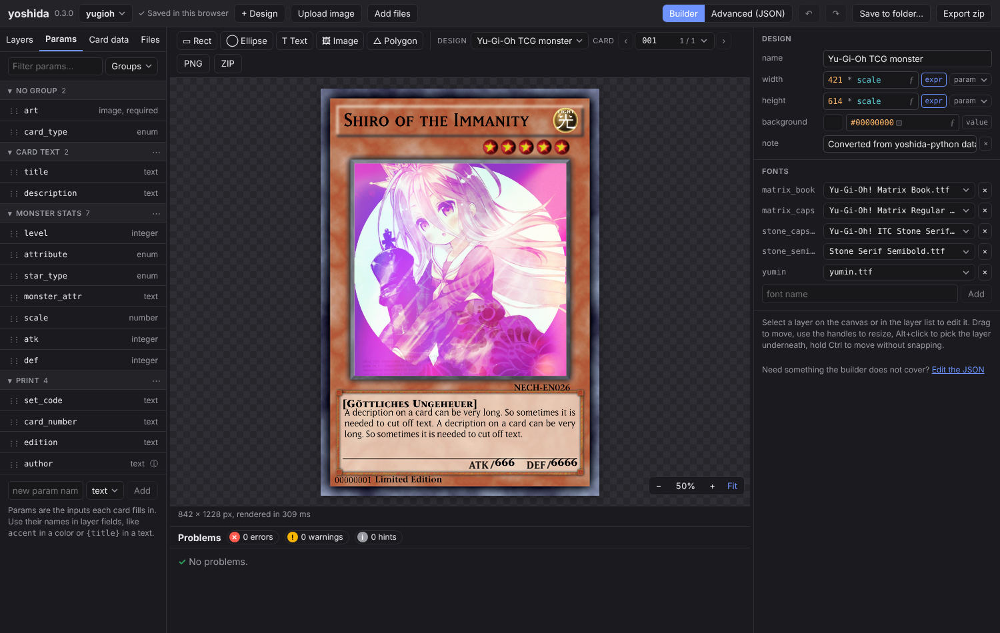

<p align="center">
  
</p>
<p align="center">
  <strong>Design, Create, Export - Your cards, your data*</strong>
</p>
<p align="center">
	*There is a toggle to render cards server-side which is <b>OPTIONAL</b> but this will cause your data to leave your local machine.
</p>

> If you are looking for the old version (the cursed origin of this) please checkout [0.3.1-python](https://github.com/XOYZ69/yoshida/releases/tag/0.3.1-python)

yoshida is the card creator I always wanted. Way too complicated, way too many possibilties... and now with a functional Browser version.
Design your cards and just apply the data, press export and happy playing, printing, whatever you wanna do.

Designs are simple json files that are easy to share, modify and abuse as much as you want.

<p align="center">
  
</p>

> Some links to wiki entries or content might be broken atm please. Just visit the wiki directly [here](https://github.com/XOYZ69/yoshida/wiki).

## Features

- Fully functional **Browser based Editor**
- **Layers** to create any shape, text or effect you need (if something is missing open an issue)
- Use **Formulas** to manipulate every value possible
- **Clear error messages** - Probably the best feature
- Easy **Docker** Deployment with `docker compose up --build`

## Quick start

**Run the editor with Docker**

```sh
docker build -t yoshida .
docker run -p 8080:8080 yoshida
```

**Or use a release zip** (prebuilt for Linux, macOS and Windows, nothing to install):

unzip it and run `./start.sh` (Linux), double-click `start.command` (macOS) or `start.bat` (Windows), then open <http://localhost:8080>.

**Or render from the command line**

```sh
yoshida check  examples/feature-tour
yoshida render examples/feature-tour --out out
```

## Project files

The editor exports a whole project (designs, card files, images and fonts) as a single `.yoshida` file. It is a zip container, like `.docx`, so you can share it, open it again with **Open project file…** or by dropping it on the editor, and unpack it with any archive tool after renaming it to `.zip`. Plain `.zip` projects from older exports still open. See [FORMAT.md](FORMAT.md#project-file-yoshida).

## Build from source

You need [Zig 0.16.0](https://ziglang.org/download/) (or `pip install ziglang==0.16.0`) and, for the editor, Node 22.

```sh
zig build test                        # unit tests
zig build -Doptimize=ReleaseFast      # zig-out/bin/yoshida and zig-out/bin/yoshida-server
zig build wasm                        # zig-out/web/yoshida.wasm

cd web && npm install
npm run wasm && npm run examples && npm run dev    # editor on http://localhost:5173
```

More in [Building from Source](../../wiki/Building-from-Source).

## Third-party code

yoshida bundles a few small libraries so that it builds without any C dependencies installed:

| Library                                                  | Used for                              | License                   |
| -------------------------------------------------------- | ------------------------------------- | ------------------------- |
| [stb_image](https://github.com/nothings/stb)             | Loading PNG, JPEG, GIF and BMP images | Public domain / MIT       |
| [stb_truetype](https://github.com/nothings/stb)          | Reading fonts and drawing text        | Public domain / MIT       |
| [simplewebp](https://github.com/MikuAuahDark/simplewebp) | Loading WebP images                   | BSD-3-Clause              |
| [Lato](https://www.latofonts.com)                        | Default font                          | SIL Open Font License 1.1 |

The C libraries are single-header files in [`src/c/`](src/c). Why they are large and how to update them is described in [`src/c/README.md`](src/c/README.md).

## Documentation

The **[wiki](../../wiki)** has a page for every feature:

|                                                                                             |                                                   |
| ------------------------------------------------------------------------------------------- | ------------------------------------------------- |
| [Getting Started](../../wiki/Getting-Started)                                               | First card, in the editor and on the command line |
| [Command Line](../../wiki/Command-Line) · [Server and Docker](../../wiki/Server-and-Docker) | Options, exit codes, the HTTP API                 |
| [Designs](../../wiki/Designs) · [Params](../../wiki/Params) · [Layers](../../wiki/Layers)   | The file format                                   |
| [Expressions](../../wiki/Expressions) · [Card Data](../../wiki/Card-Data)                   | Formulas, templates, JSON and CSV                 |
| [Builder](../../wiki/Builder)                                                               | The visual editor, panel by panel, with shortcuts |
| [Diagnostics](../../wiki/Diagnostics)                                                       | Every error code and how to fix it                |
| [Architecture](../../wiki/Architecture)                                                     | Core, WebAssembly, server                         |

Working projects are in [`examples/`](examples).
